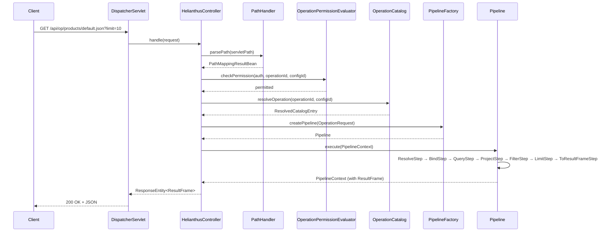

# Helianthus

Helianthus is a Kotlin-first declarative backend platform inspired by Apache Cocoon, ColdFusion, Supabase, and PostgREST. It allows developers to define operations, entities, and data pipelines declaratively, exposing APIs and multiple representations without requiring custom controller development.

The current codebase is a modernization of a legacy Java middleware that already demonstrates this core value proposition: SQL operations exposed as HTTP endpoints returning JSON, XML, HTML, or CSV. The platform is being rebuilt with a clean Kotlin foundation while preserving the core idea.

## Why Helianthus Exists

Most backend development involves writing repetitive controllers, services, and repositories to expose data over HTTP. Helianthus inverts this model: you declare what you want — an operation, its SQL, its output format — and the platform handles the HTTP layer automatically.

Inspiration drawn from:
- **Apache Cocoon** — pipelines, XML transformations, declarative flows
- **ColdFusion** — ease of data exposure, rapid development
- **Supabase** — auto-generated APIs from database schema
- **PostgREST** — direct HTTP access to database operations

## Request Flow



## Component Architecture

```mermaid
classDiagram
    class HelianthusApplication {
        +main(args: Array~String~)
    }

    class HelianthusController {
        +handle(request: HttpServletRequest) ResponseEntity~ResultFrame~
        -pathHandler: PathHandler
        -catalog: OperationCatalog
        -pipelineFactory: PipelineFactory
        -permissionEvaluator: OperationPermissionEvaluator
    }

    class PathHandler {
        +parsePath(path: String?) PathMappingResultBean
        -PATH_PREFIX: String = "/api/op/"
        -DEFAULT_CONFIGURATION: String = "default"
    }

    class OperationCatalog {
        +operations: Map~String, OperationDef~
        +queries: Map~String, QueryDef~
        +datasources: Map~String, DatasourceDef~
        +resolveOperation(operationId, configurationId?) ResolvedCatalogEntry
    }

    class PipelineFactory {
        +createPipeline(request: OperationRequest) Pipeline
    }

    class Pipeline {
        +execute(context: PipelineContext) PipelineContext
    }

    class PipelineComponent {
        <<interface>>
        +process(context: PipelineContext) PipelineContext
    }

    class ResolveStep {
        -catalog: OperationCatalog
        +process(context: PipelineContext) PipelineContext
    }
    class BindStep {
        +process(context: PipelineContext) PipelineContext
    }
    class QueryStep {
        -dataAccess: GenericDataAccess
        +process(context: PipelineContext) PipelineContext
    }
    class ProjectStep {
        +process(context: PipelineContext) PipelineContext
    }
    class FilterStep {
        +process(context: PipelineContext) PipelineContext
    }
    class LimitStep {
        +process(context: PipelineContext) PipelineContext
    }
    class ToResultFrameStep {
        +process(context: PipelineContext) PipelineContext
    }

    class ResultFrame {
        +schema: ResultSchema
        +rows: List~Map~String, Any?~~
        +metadata: ResultMetadata
    }

    class GenericDataAccess {
        <<interface>>
        +executeQueryStream(sql, typeNames, datasource, fetchSize, paramValues) CloseableRowStream
    }

    class JdbcGenericDataAccess {
        -dataSource: DataSource
        +executeQueryStream(...) CloseableRowStream
    }

    HelianthusApplication ..> HelianthusController : bootstraps
    HelianthusController --> PathHandler
    HelianthusController --> OperationCatalog
    HelianthusController --> PipelineFactory
    HelianthusController --> OperationPermissionEvaluator
    PipelineFactory --> Pipeline
    Pipeline --> PipelineComponent
    ResolveStep --> OperationCatalog
    QueryStep --> GenericDataAccess
    JdbcGenericDataAccess ..|> GenericDataAccess

    note for HelianthusController "Entry point for /api/op/**"
    note for PathHandler "Parses /api/op/{operationId}.{format}"
    note for OperationCatalog "Loaded from operations.yml"
    note for Pipeline "Executes steps: Resolve → Bind → Query → Project → Filter → Limit → ToResultFrame"
```



## Project Layout

```
helianthus/
├── server/                           # Kotlin/Java Maven multi-module backend
│   ├── Dockerfile                    # Multi-stage container build
│   ├── pom.xml                       # Parent POM (helianthus-parent)
│   ├── helianthus/                   # helianthus-core: interfaces, JDBC, result types
│   │   └── src/main/kotlin/
│   │       └── helianthus/core/
│   │           ├── access/           # GenericDataAccess, JdbcGenericDataAccess
│   │           ├── bean/             # TableResultBean, ColumnResultBean
│   │           ├── result/           # ResultFrame, ResultSchema, ResultColumn, ResultType
│   │           └── util/             # Context, SpringContextImpl (legacy)
│   └── helianthus-web/               # Spring Boot application, HTTP layer
│       └── src/main/kotlin/
│           └── helianthus/core/
│               ├── HelianthusApplication.kt  # Spring Boot entry point
│               ├── catalog/                  # OperationCatalog, catalog models
│               ├── config/                  # CatalogConfig (YAML loader)
│               ├── exception/                # InvalidOperationPathException
│               ├── pipeline/                # Pipeline, steps, models
│               ├── security/                # OperationPermissionEvaluator
│               ├── util/                    # PathHandler
│               └── web/                     # HelianthusController, HealthController,
│                                           #   HelianthusExceptionHandler, CatalogController
├── client/                            # React + TypeScript admin UI
│   ├── Dockerfile                     # Multi-stage build (node + nginx)
│   ├── nginx.conf                     # Nginx config for SPA serving
│   ├── src/
│   ├── package.json
│   └── README.md
├── samples/starter/                   # Starter environment artifacts
│   ├── operations.yml                 # Seeded operations catalog
│   └── db/
│       ├── schema.sql                 # Sample schema
│       └── init.sql                   # Sample data
├── docs/
│   ├── DOCKER-STARTER-DESIGN.md
│   └── legacy/                        # Historical reference files
├── docker-compose.yml                  # Clean stack (PostgreSQL only)
├── docker-compose.starter.yml         # Full stack: Postgres + Keycloak + server + client
└── .env.example                       # Environment variables template
```

## Technology

- Java 25, Kotlin 2.3, Maven multi-module
- Spring Boot 4.1.0 (Spring MVC, Spring JDBC, Spring Security)
- PostgreSQL with HikariCP connection pooling
- Jackson (JSON via Spring's message converters)

## Operations Catalog

Operations are declared in `operations.yml`. Example:

```yaml
app:
  name: helianthus

datasources:
  default:
    type: postgres

queries:
  allProducts:
    sql: SELECT productCode, productName, buyPrice FROM products

operations:
  products:
    queryRef: allProducts
    parameters:
      - name: limit
        type: int
    configurations:
      default:
        pipeline:
          - limit: 20
      compact:
        pipeline:
          - project: [productCode, productName]
          - limit: 10
```

Request: `GET /api/op/products/default.json`

## Quick Start

### Clean stack (PostgreSQL only)

```bash
# Start PostgreSQL
docker compose up -d

# Build and run the server
cd server
mvn clean install -DskipTests
java -jar helianthus-web/target/helianthus-web-1.0.jar
```

```bash
curl http://localhost:8080/health
# {"status":"ok","service":"helianthus"}
```

### Starter stack (PostgreSQL + Keycloak + server + client)

```bash
docker compose -f docker-compose.starter.yml up --build
```

This starts the complete Helianthus environment:
- **PostgreSQL** on port 5432 — preloaded with sample product data
- **Keycloak** on port 8081 — identity provider with preconfigured realm
- **Helianthus server** on port 8080 — API backend with seeded operations catalog
- **Helianthus client** on port 5173 — React admin UI

Once running:
- **Admin UI:** http://localhost:5173
- **API:** http://localhost:8080
- **Keycloak console:** http://localhost:8081 (admin/admin)

**Test credentials:**
- guest / guest (GUEST role)
- admin / admin (ADMIN role)

Try these API endpoints:

```bash
# Health check (no auth required)
curl http://localhost:8080/health

# All products (requires authentication)
curl -u guest:guest http://localhost:8080/api/op/products/default.json

# Compact view (projected columns)
curl -u guest:guest http://localhost:8080/api/op/products/compact.json

# Expensive products (filtered + projected)
curl -u guest:guest http://localhost:8080/api/op/products/expensive.json

# Single product by code
curl -u guest:guest "http://localhost:8080/api/op/product/default.json?productCode=S10_1678"

# All product lines
curl -u guest:guest http://localhost:8080/api/op/productlines/default.json
```

Stop the starter stack:

```bash
docker compose -f docker-compose.starter.yml down -v
```

## Current Status

Phase 4 complete. The platform uses a YAML operations catalog with reusable queries, named configurations, and pipeline steps (project, filter, limit). Operations are resolved declaratively — HTTP requests never contain SQL.

See [docs/DOCKER-STARTER-DESIGN.md](docs/DOCKER-STARTER-DESIGN.md) for the starter environment design.
