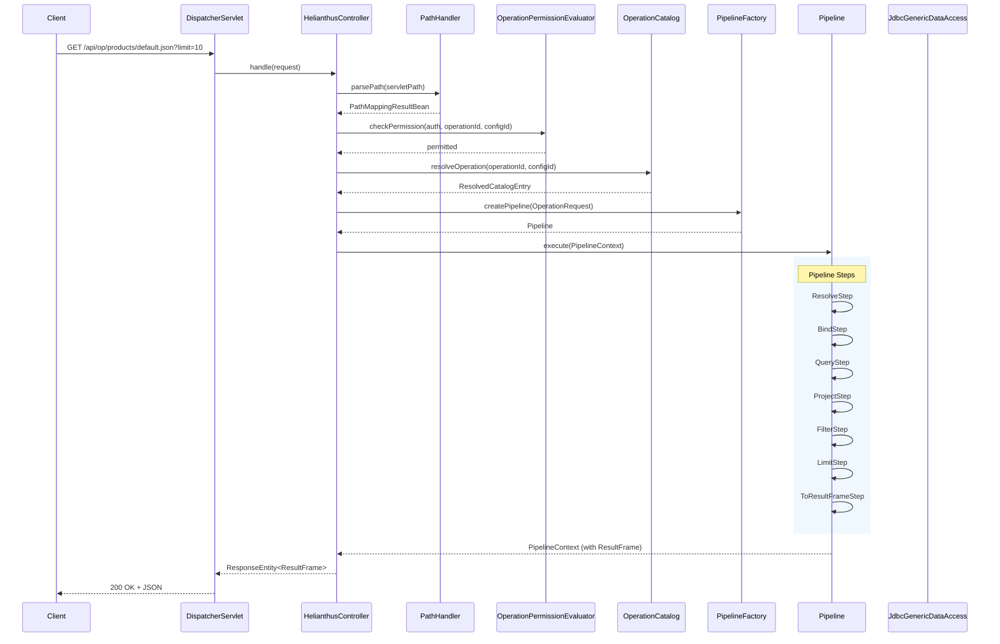

# Helianthus

Helianthus is a Kotlin-first declarative backend platform inspired by Apache Cocoon, ColdFusion, Supabase, and PostgREST. It allows developers to define operations, entities, and data pipelines declaratively, exposing APIs and multiple representations without requiring custom controller development.

The current codebase is a modernization of a legacy Java middleware that already demonstrates this core value proposition: SQL operations exposed as HTTP endpoints returning JSON, XML, HTML, or CSV. The platform is being rebuilt with a clean Kotlin foundation while preserving the core idea.

## Why Helianthus Exists

Most backend development involves writing repetitive controllers, services, and repositories to expose data over HTTP. Helianthus inverts this model: you declare what you want — an operation, its SQL, its output format — and the platform handles the HTTP layer automatically.

Inspiration drawn from:
- **Apache Cocoon** — pipelines, XML transformations, declarative flows
- **ColdFusion** — ease of data exposure, rapid development
- **Supabase** — auto-generated APIs from database schema
- **PostgREST** — direct HTTP access to database operations

## Request Flow



## Component Architecture

```mermaid
classDiagram
    class HelianthusApplication {
        +main(args: Array~String~)
    }

    class HelianthusController {
        +handle(request: HttpServletRequest) ResponseEntity~ResultFrame~
        -pathHandler: PathHandler
        -catalog: OperationCatalog
        -pipelineFactory: PipelineFactory
        -permissionEvaluator: OperationPermissionEvaluator
    }

    class PathHandler {
        +parsePath(path: String?) PathMappingResultBean
        -PATH_PREFIX: String = "/api/op/"
        -DEFAULT_CONFIGURATION: String = "default"
    }

    class OperationCatalog {
        +operations: Map~String, OperationDef~
        +queries: Map~String, QueryDef~
        +datasources: Map~String, DatasourceDef~
        +resolveOperation(operationId, configurationId?) ResolvedCatalogEntry
    }

    class OperationPermissionEvaluator {
        +checkPermission(auth, operationId, configId) Boolean
    }

    class SecurityConfig {
        +configure(HttpSecurity)
    }

    class DataSourceConfig {
        +dataSource(): DataSource
        +secondaryDataSource(): DataSource
    }

    class CatalogConfig {
        +operationCatalog(): OperationCatalog
    }

    class PipelineFactory {
        +createPipeline(request: OperationRequest) Pipeline
    }

    class Pipeline {
        +execute(context: PipelineContext) PipelineContext
    }

    class PipelineComponent {
        <<interface>>
        +process(context: PipelineContext) PipelineContext
    }

    class ResolveStep {
        -catalog: OperationCatalog
        +process(context: PipelineContext) PipelineContext
    }
    class BindStep {
        +process(context: PipelineContext) PipelineContext
    }
    class QueryStep {
        -dataAccess: GenericDataAccess
        +process(context: PipelineContext) PipelineContext
    }
    class ProjectStep {
        +process(context: PipelineContext) PipelineContext
    }
    class FilterStep {
        +process(context: PipelineContext) PipelineContext
    }
    class LimitStep {
        +process(context: PipelineContext) PipelineContext
    }
    class ToResultFrameStep {
        +process(context: PipelineContext) PipelineContext
    }

    class ResultFrame {
        +schema: ResultSchema
        +rows: List~Map~String, Any?~~
        +metadata: ResultMetadata
    }

    class GenericDataAccess {
        <<interface>>
        +executeQueryStream(sql, typeNames, datasource, fetchSize, paramValues) CloseableRowStream
    }

    class JdbcGenericDataAccess {
        -dataSources: Map~String, DataSource~
        +executeQueryStream(...) CloseableRowStream
    }

    class ResultFrameJsonMessageConverter
    class ResultFrameXmlMessageConverter
    class ResultFrameCsvMessageConverter
    class ResultFrameHtmlMessageConverter

    HelianthusApplication ..> HelianthusController : bootstraps
    HelianthusController --> PathHandler
    HelianthusController --> OperationCatalog
    HelianthusController --> PipelineFactory
    HelianthusController --> OperationPermissionEvaluator
    HelianthusController --> SecurityConfig
    PipelineFactory --> Pipeline
    Pipeline --> PipelineComponent
    ResolveStep --> OperationCatalog
    QueryStep --> GenericDataAccess
    JdbcGenericDataAccess ..|> GenericDataAccess

    HelianthusController --> ResultFrameJsonMessageConverter
    HelianthusController --> ResultFrameXmlMessageConverter
    HelianthusController --> ResultFrameCsvMessageConverter
    HelianthusController --> ResultFrameHtmlMessageConverter

    note right for HelianthusController "Entry point for /api/op/**"
    note right for PathHandler "Parses /api/op/{operationId}.{format}"
    note right for OperationCatalog "Loaded from operations.yml"
    note bottom for Pipeline "Steps: Resolve → Bind → Query → Project → Filter → Limit → ToResultFrame"
```

## Project Layout

```
helianthus/
├── server/                           # Kotlin/Java Maven multi-module backend
│   ├── Dockerfile                    # Multi-stage container build
│   ├── pom.xml                       # Parent POM (helianthus-parent)
│   ├── helianthus/                   # helianthus-core: interfaces, JDBC, result types
│   │   └── src/main/kotlin/
│   │       └── helianthus/core/
│   │           ├── access/           # GenericDataAccess, JdbcGenericDataAccess
│   │           ├── bean/             # TableResultBean, ColumnResultBean
│   │           ├── result/            # ResultFrame, ResultSchema, ResultColumn, ResultType
│   │           └── util/              # Context, SpringContextImpl (legacy)
│   └── helianthus-web/               # Spring Boot application, HTTP layer
│       └── src/main/kotlin/
│           └── helianthus/core/
│               ├── HelianthusApplication.kt  # Spring Boot entry point
│               ├── catalog/                  # OperationCatalog, catalog models
│               ├── config/
│               │   ├── CatalogConfig.kt       # YAML catalog loader
│               │   ├── DataSourceConfig.kt   # Multi-datasource configuration
│               │   ├── SecurityConfig.kt     # Spring Security + Keycloak OIDC
│               │   └── HelianthusWebConfiguration.kt
│               ├── exception/                # InvalidOperationPathException
│               ├── pipeline/                  # Pipeline, steps, models
│               ├── security/                  # OperationPermissionEvaluator
│               ├── web/
│               │   ├── HelianthusController.kt  # /api/op/** entry point
│               │   ├── HealthController.kt      # /health endpoint
│               │   ├── HelianthusExceptionHandler.kt
│               │   ├── CatalogController.kt     # /catalog endpoint
│               │   ├── RequestLoggingFilter.kt
│               │   └── converter/
│               │       ├── ResultFrameJsonMessageConverter.kt
│               │       ├── ResultFrameXmlMessageConverter.kt
│               │       ├── ResultFrameCsvMessageConverter.kt
│               │       └── ResultFrameHtmlMessageConverter.kt
│               └── util/                    # PathHandler
├── client/                            # React + TypeScript admin UI
│   ├── Dockerfile                    # Multi-stage build (node + nginx)
│   ├── nginx.conf                    # Nginx config for SPA serving
│   ├── src/
│   ├── package.json
│   └── README.md
├── samples/starter/                   # Starter environment artifacts
│   ├── operations.yml                 # Seeded operations catalog (multi-datasource)
│   └── db/
│       ├── schema.sql                 # Primary database schema
│       ├── init.sql                   # Primary database seed data
│       ├── secondary-schema.sql       # Secondary database schema
│       └── secondary-init.sql         # Secondary database seed data
├── docker/
│   └── keycloak/
│       └── helianthus-realm.json      # Keycloak realm configuration
├── docs/
│   ├── DOCKER-STARTER-DESIGN.md
│   └── legacy/                        # Historical reference files
├── docker-compose.yml                  # Clean stack (PostgreSQL only)
├── docker-compose.starter.yml         # Full stack: 2x PostgreSQL + Keycloak + server + client
└── .env.example                       # Environment variables template
```

## Technology

- Java 25, Kotlin 2.3, Maven multi-module
- Spring Boot 4.1.0 (Spring MVC, Spring JDBC, Spring Security)
- Spring Security with Keycloak OIDC integration
- PostgreSQL with HikariCP connection pooling (supports multiple datasources)
- Jackson (JSON), custom converters (XML, HTML, CSV)

## Operations Catalog

Operations are declared in `operations.yml`. The catalog supports:
- **Multiple datasources**: Configure any number of named datasources
- **Reusable queries**: Define SQL once, reference from multiple operations
- **Named configurations**: Different pipeline settings per operation variant
- **Pipeline transformations**: project, filter, limit
- **Role-based security**: Per-operation access control via Keycloak roles

```yaml
app:
  name: Helianthus Starter

datasources:
  default:
    type: postgres
  secondary:
    type: postgres

queries:
  products.base:
    datasource: default
    sql: SELECT * FROM products ORDER BY productCode

operations:
  products:
    queryRef: products.base
    configurations:
      default:
        pipeline:
          - limit: 100
      compact:
        pipeline:
          - project: [productCode, productName, productLine]
          - limit: 50
      expensive:
        pipeline:
          - filter:
              buyPrice:
                gt: 50
          - project: [productCode, productName, buyPrice]

  # Secondary datasource operation
  customers:
    datasource: secondary
    query: SELECT * FROM customers ORDER BY customerName
    security:
      roles:
        - ADMIN
```

Request: `GET /api/op/products/default.json`

## Supported Output Formats

| Format | Content-Type | Converter |
|--------|-------------|-----------|
| JSON | application/json | Jackson (auto-configured) |
| XML | application/xml | ResultFrameXmlMessageConverter |
| HTML | text/html | ResultFrameHtmlMessageConverter |
| CSV | text/csv | ResultFrameCsvMessageConverter |

## Quick Start

### Clean stack (PostgreSQL only)

```bash
# Start PostgreSQL
docker compose up -d

# Build and run the server
cd server
mvn clean install -DskipTests
java -jar helianthus-web/target/helianthus-web-1.0.jar
```

```bash
curl http://localhost:8080/health
# {"status":"ok","service":"helianthus"}
```

### Starter stack (2x PostgreSQL + Keycloak + server + client)

```bash
docker compose -f docker-compose.starter.yml up --build
```

This starts the complete Helianthus environment:
- **PostgreSQL (default)** on port 5432 — preloaded with product data
- **PostgreSQL (secondary)** on port 5433 — preloaded with customer data
- **Keycloak** on port 8081 — identity provider with preconfigured realm
- **Helianthus server** on port 8080 — API backend with seeded operations catalog
- **Helianthus client** on port 5173 — React admin UI

Once running:
- **Admin UI:** http://localhost:5173
- **API:** http://localhost:8080
- **Keycloak console:** http://localhost:8081 (admin/admin)

**Test credentials:**
- guest / guest (GUEST role)
- admin / admin (ADMIN role)

Try these API endpoints:

```bash
# Health check (no auth required)
curl http://localhost:8080/health

# All products (requires authentication)
curl -u guest:guest http://localhost:8080/api/op/products/default.json

# Compact view (projected columns)
curl -u guest:guest http://localhost:8080/api/op/products/compact.json

# Expensive products (filtered + projected)
curl -u guest:guest http://localhost:8080/api/op/products/expensive.json

# Single product by code
curl -u guest:guest "http://localhost:8080/api/op/product/default.json?productCode=S10_1678"

# All product lines
curl -u guest:guest http://localhost:8080/api/op/productlines/default.json

# Different output formats
curl -u guest:guest http://localhost:8080/api/op/products/default.xml
curl -u guest:guest http://localhost:8080/api/op/products/default.html
curl -u guest:guest http://localhost:8080/api/op/products/default.csv

# Customer from secondary database (admin only)
curl -u admin:admin http://localhost:8080/api/op/customers/default.json
```

Stop the starter stack:

```bash
docker compose -f docker-compose.starter.yml down -v
```

## Current Status

Phase 4/5 complete. The platform uses a YAML operations catalog with:
- Multiple datasource support (default and secondary)
- Reusable named queries
- Named operation configurations with pipeline transformations (project, filter, limit)
- Keycloak OIDC integration for authentication and authorization
- Four output formats: JSON, XML, HTML, CSV

See [docs/DOCKER-STARTER-DESIGN.md](docs/DOCKER-STARTER-DESIGN.md) for the starter environment design.
