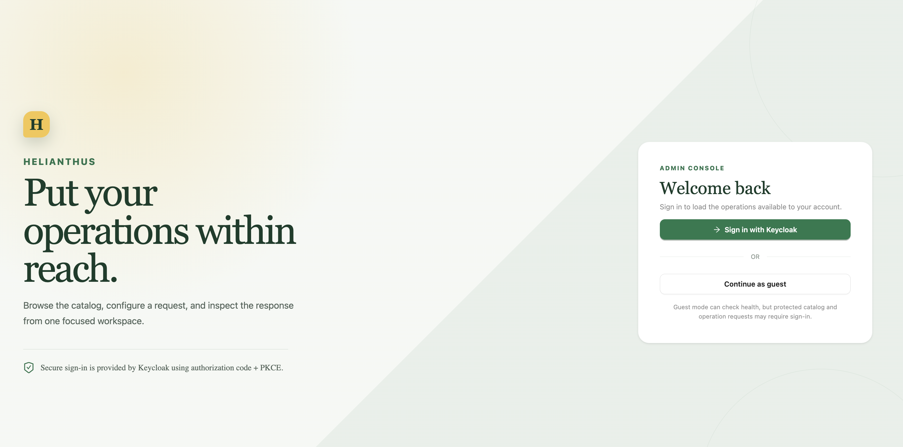
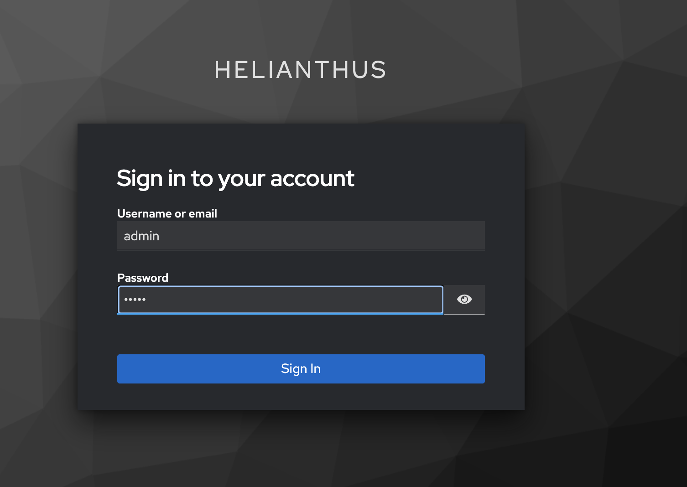
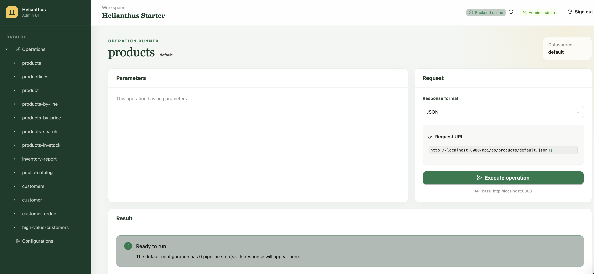
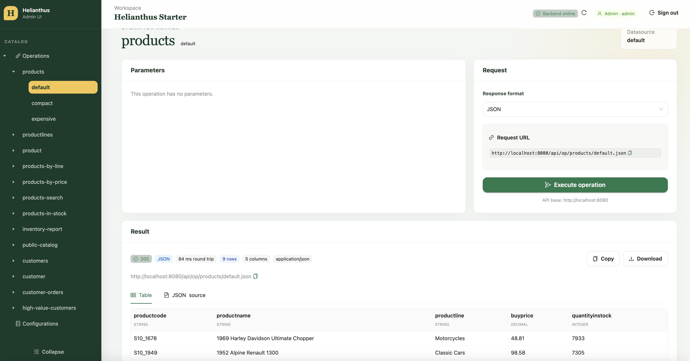
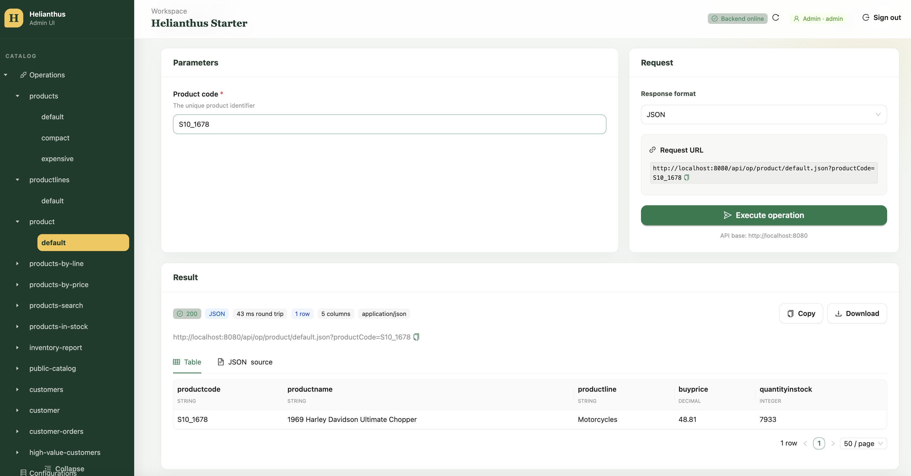
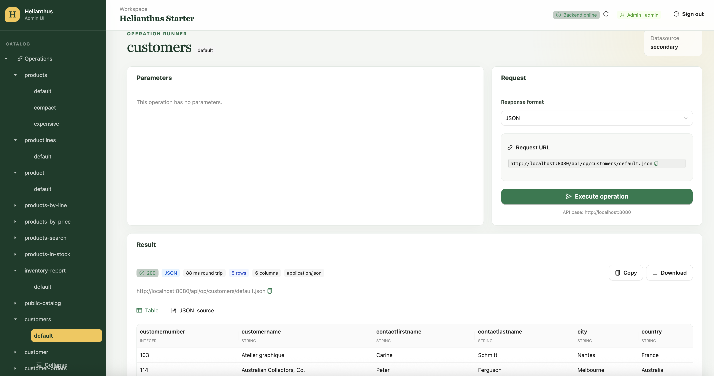

# Helianthus User Guide

A comprehensive guide for backend developers to understand, configure, and use Helianthus.

## Table of Contents

- [What is Helianthus?](#what-is-helianthus)
- [Philosophy](#philosophy)
- [Quick Start with Docker](#quick-start-with-docker)
- [Understanding the Operations Catalog](#understanding-the-operations-catalog)
- [Defining Operations](#defining-operations)
- [Pipeline Transformations](#pipeline-transformations)
- [Parameters and Inputs](#parameters-and-inputs)
- [Multiple Datasources](#multiple-datasources)
- [Security and Authentication](#security-and-authentication)
- [Output Formats](#output-formats)
- [Using the Admin UI](#using-the-admin-ui)
- [API Examples](#api-examples)
- [Troubleshooting](#troubleshooting)

---

## What is Helianthus?

Helianthus is a **declarative backend platform** that exposes SQL operations as HTTP endpoints. Instead of writing controllers, services, and repositories for every data operation, you declare what you want in a YAML file, and Helianthus handles the HTTP layer automatically.

**Key features:**
- Define operations declaratively in `operations.yml`
- Automatic HTTP endpoints for every operation
- Multiple output formats: JSON, XML, HTML, CSV
- Pipeline transformations: project, filter, limit
- Multiple datasource support
- Role-based security via Keycloak
- Admin UI for exploring and testing operations

---

## Philosophy

Helianthus is inspired by:
- **Apache Cocoon** — pipelines, XML transformations, declarative flows
- **ColdFusion** — ease of data exposure, rapid development
- **Supabase** — auto-generated APIs from database schema
- **PostgREST** — direct HTTP access to database operations

The core idea: **you declare what you want, the platform handles the rest.**

Most backend development involves writing repetitive controllers, services, and repositories to expose data over HTTP. Helianthus inverts this model. You define an operation with its SQL, parameters, and output format — and the platform automatically creates the HTTP endpoint.

---

## Quick Start with Docker

The easiest way to explore Helianthus is using the starter Docker environment, which includes pre-seeded databases, Keycloak authentication, and sample operations.

### Prerequisites

- Docker and Docker Compose installed
- Ports 5432, 5433, 8080, 8081, 5173 available

### Start the Environment

```bash
docker compose -f docker-compose.starter.yml up --build
```

This starts:
- **PostgreSQL (default)** on port 5432 — products database
- **PostgreSQL (secondary)** on port 5433 — customers database
- **Keycloak** on port 8081 — identity provider
- **Helianthus server** on port 8080 — API backend
- **Helianthus client** on port 5173 — Admin UI

### Test Credentials

| User | Password | Role |
|------|----------|------|
| guest | guest | GUEST |
| admin | admin | ADMIN |

### Access Points

- **Admin UI:** http://localhost:5173
- **API:** http://localhost:8080
- **Keycloak console:** http://localhost:8081 (admin/admin)
- **Health check:** http://localhost:8080/health

### Stop the Environment

```bash
docker compose -f docker-compose.starter.yml down -v
```

The `-v` flag removes volumes, clearing seeded data for a fresh start next time.

---

## Understanding the Operations Catalog

The operations catalog is defined in `operations.yml`. This file is the heart of Helianthus — it declares all available operations, their SQL queries, parameters, and pipeline transformations.

### File Structure

```yaml
app:
  name: Helianthus Starter

datasources:
  default:
    type: postgres
  secondary:
    type: postgres

queries:
  products.base:
    datasource: default
    sql: SELECT * FROM products ORDER BY productCode

operations:
  products:
    queryRef: products.base
    configurations:
      default:
        pipeline:
          - limit: 100
```

### Key Concepts

1. **App metadata** — Optional name and description for your application
2. **Datasources** — Named database connections (default, secondary, etc.)
3. **Queries** — Reusable SQL definitions that can be referenced by multiple operations
4. **Operations** — The actual endpoints, combining queries with parameters and pipeline transformations
5. **Configurations** — Variants of an operation with different pipeline settings

---

## Defining Operations

### Basic Operation

The simplest operation references a query and applies a limit:

```yaml
operations:
  products:
    label: Products
    description: Product catalog operations
    queryRef: products.base
    configurations:
      default:
        label: Default
        pipeline:
          - limit: 100
```

This creates the endpoint: `GET /api/op/products/default.json`

### Inline Query

You can define the SQL directly in the operation instead of using `queryRef`:

```yaml
operations:
  product:
    label: Single Product
    description: Look up a specific product by code
    query: SELECT * FROM products WHERE productCode = ?
    parameters:
      - name: productCode
        type: string
        required: true
        label: Product code
        description: The unique product identifier
        placeholder: S10_1678
        input:
          kind: text
    configurations:
      default:
        pipeline:
          - limit: 1
```

This creates: `GET /api/op/product/default.json?productCode=S10_1678`

### Multiple Configurations

An operation can have multiple configurations, each with different pipeline transformations:

```yaml
operations:
  products:
    queryRef: products.base
    configurations:
      default:
        label: Default
        description: Standard product list
        pipeline:
          - limit: 100
      compact:
        label: Compact
        description: Projected columns only
        pipeline:
          - project: [productCode, productName, productLine]
          - limit: 50
      expensive:
        label: Expensive
        description: Products over $50
        pipeline:
          - filter:
              buyPrice:
                gt: 50
          - project: [productCode, productName, buyPrice]
          - limit: 100
```

This creates three endpoints:
- `GET /api/op/products/default.json` — all products
- `GET /api/op/products/compact.json` — projected columns
- `GET /api/op/products/expensive.json` — filtered and projected

---

## Pipeline Transformations

The pipeline processes query results through a series of transformations. Available steps:

### Limit

Restricts the number of rows returned:

```yaml
pipeline:
  - limit: 100
```

### Project

Selects specific columns from the result:

```yaml
pipeline:
  - project: [productCode, productName, productLine]
```

**Note:** Column names are resolved case-insensitively. The order in the YAML determines the output order.

### Filter

Filters rows based on column conditions:

```yaml
pipeline:
  - filter:
      buyPrice:
        gt: 50
```

**Supported operators:**
- `eq` — equal
- `neq` — not equal
- `gt` — greater than
- `gte` — greater than or equal
- `lt` — less than
- `lte` — less than or equal
- `in` — in list
- `like` — SQL LIKE pattern

**Example with multiple conditions:**

```yaml
pipeline:
  - filter:
      buyPrice:
        gte: 50
        lte: 100
      productLine:
        eq: "Classic Cars"
```

### Pipeline Order

Steps execute in order. Common pattern:

```yaml
pipeline:
  - filter:
      buyPrice:
        gt: 50
  - project: [productCode, productName, buyPrice]
  - limit: 100
```

This filters first, then projects columns, then limits rows.

---

## Parameters and Inputs

Operations can accept parameters from the HTTP request. Parameters are defined in the operation and bound to SQL placeholders (`?`).

### Parameter Definition

```yaml
parameters:
  - name: productCode
    type: string
    required: true
    label: Product code
    description: The unique product identifier
    placeholder: S10_1678
    input:
      kind: text
```

### Parameter Types

| Type | Description | Example |
|------|-------------|---------|
| `string` | Text value | `productCode` |
| `number` | Numeric value | `buyPrice` |
| `integer` | Integer value | `quantityInStock` |
| `boolean` | True/false | `inStockOnly` |
| `date` | Date value | `orderDate` |

### Input Kinds

The `input.kind` determines how the parameter is presented in the Admin UI:

| Kind | Description | Options |
|------|-------------|---------|
| `text` | Text input field | `placeholder` |
| `number` | Numeric input | `min`, `max`, `step` |
| `boolean` | Checkbox | — |
| `select` | Dropdown | `options: [val1, val2]` |

### Required vs Optional

- **Required parameters** must be provided. Missing required parameters return a 400 error.
- **Optional parameters** can be omitted. The SQL should handle null values.

**Example with optional parameter:**

```yaml
parameters:
  - name: productLine
    type: string
    required: false
    label: Product Line (Optional)
    input:
      kind: select
      options:
        - Classic Cars
        - Motorcycles
        - Planes
```

**SQL handling optional parameters:**

```sql
SELECT * FROM products 
WHERE (? = false OR quantityInStock > 0) 
ORDER BY quantityInStock DESC
```

---

## Multiple Datasources

Helianthus supports multiple named datasources. Operations can specify which datasource to use.

### Defining Datasources

```yaml
datasources:
  default:
    type: postgres
  secondary:
    type: postgres
```

### Using a Specific Datasource

```yaml
operations:
  customers:
    label: Customers
    description: Customer list from secondary database
    datasource: secondary  # <-- specifies the datasource
    query: SELECT customerNumber, customerName FROM customers ORDER BY customerName
    configurations:
      default:
        pipeline:
          - limit: 100
```

### Docker Environment Setup

In the starter environment, two PostgreSQL instances are configured:

| Datasource | Host | Port | Database |
|------------|------|------|----------|
| default | postgres | 5432 | helianthus |
| secondary | postgres-secondary | 5432 | helianthus_secondary |

The `docker-compose.starter.yml` mounts seed SQL files for automatic initialization:

```yaml
volumes:
  - ./samples/starter/db/schema.sql:/docker-entrypoint-initdb.d/01-schema.sql:ro
  - ./samples/starter/db/init.sql:/docker-entrypoint-initdb.d/02-init.sql:ro
```

---

## Security and Authentication

Helianthus integrates with Keycloak for authentication and role-based authorization.

### Security Configuration

Operations can restrict access by role:

```yaml
operations:
  inventory-report:
    label: Inventory Report
    description: Detailed inventory report (Admin only)
    query: SELECT * FROM products ORDER BY buyPrice
    security:
      roles:
        - ADMIN
    configurations:
      default:
        pipeline:
          - limit: 100
```

### Role-Based Access

| Role | Access |
|------|--------|
| `ADMIN` | All operations |
| `GUEST` | Public operations only |
| No security | Accessible to all authenticated users |

### Test Users

The starter Keycloak realm includes:

| Username | Password | Role |
|----------|----------|------|
| guest | guest | GUEST |
| admin | admin | ADMIN |

### Authentication Flow

1. User accesses Admin UI or API
2. Redirected to Keycloak login page
3. After login, receives JWT token
4. Token validated on each request
5. Operation permission checked against user roles

---

## Output Formats

Every operation supports multiple output formats via the URL extension:

| Format | Extension | Content-Type |
|--------|-----------|--------------|
| JSON | `.json` | `application/json` |
| XML | `.xml` | `application/xml` |
| HTML | `.html` | `text/html` |
| CSV | `.csv` | `text/csv` |

### Examples

```bash
# JSON (default)
curl http://localhost:8080/api/op/products/default.json

# XML
curl http://localhost:8080/api/op/products/default.xml

# HTML table
curl http://localhost:8080/api/op/products/default.html

# CSV
curl http://localhost:8080/api/op/products/default.csv
```

### Format Selection in Admin UI

The Admin UI provides a dropdown to select the response format before executing an operation.

---

## Using the Admin UI

The Admin UI (http://localhost:5173) provides a visual interface for exploring and testing operations.

### Initial Screen



The landing page offers two options:
- **Sign in with Keycloak** — authenticate with admin/guest credentials
- **Continue as guest** — limited access to public operations

### Login Page



Keycloak handles authentication. Use the test credentials above.

### Operation Runner

After login, the Admin UI displays the operation catalog in the left sidebar.



**Key features:**
- **Catalog navigation** — browse operations and configurations
- **Parameters panel** — fill in required/optional parameters
- **Request panel** — select response format, view request URL
- **Result panel** — view results as table or JSON source
- **Metadata** — response time, row count, column count

### Querying Products



The `products` operation with `default` configuration shows all products with no parameters required.

### Querying with Parameters



The `product` operation requires a `productCode` parameter. The Admin UI generates the appropriate input field based on the parameter definition.

### Querying Another Datasource



The `customers` operation uses the `secondary` datasource. The UI indicates which datasource is being used.

---

## API Examples

### Health Check

```bash
curl http://localhost:8080/health
# {"status":"ok","service":"helianthus"}
```

### Basic Query

```bash
curl -u guest:guest http://localhost:8080/api/op/products/default.json
```

### With Parameters

```bash
curl -u guest:guest "http://localhost:8080/api/op/product/default.json?productCode=S10_1678"
```

### Different Configurations

```bash
# Compact view (projected columns)
curl -u guest:guest http://localhost:8080/api/op/products/compact.json

# Expensive products (filtered)
curl -u guest:guest http://localhost:8080/api/op/products/expensive.json
```

### Different Formats

```bash
# XML
curl -u guest:guest http://localhost:8080/api/op/products/default.xml

# HTML
curl -u guest:guest http://localhost:8080/api/op/products/default.html

# CSV
curl -u guest:guest http://localhost:8080/api/op/products/default.csv
```

### Secondary Datasource

```bash
# Admin-only operation
curl -u admin:admin http://localhost:8080/api/op/customers/default.json

# With parameter
curl -u admin:admin "http://localhost:8080/api/op/customer/default.json?customerNumber=103"
```

### Role-Based Access

```bash
# Guest can access public operations
curl -u guest:guest http://localhost:8080/api/op/public-catalog/default.json

# Guest cannot access admin-only operations (returns 403)
curl -u guest:guest http://localhost:8080/api/op/inventory-report/default.json

# Admin can access all operations
curl -u admin:admin http://localhost:8080/api/op/inventory-report/default.json
```

---

## Troubleshooting

### Operation Returns No Rows

1. **Check parameters** — ensure required parameters are provided
2. **Enable debug logging** — see bound parameter values
3. **Verify SQL** — check the query in `operations.yml` matches your schema

### Permission Denied (403)

1. **Check user roles** — verify the user has the required role in Keycloak
2. **Enable security logging** — see permission check details
3. **Check operation security config** — verify `security.roles` in `operations.yml`

### Database Connection Issues

1. **Check database is running** — `docker compose ps`
2. **Verify connection parameters** — check `application.yml`
3. **Check logs** — look for HikariCP connection errors

### Column Not Found Errors

Column names are resolved case-insensitively, but if you see errors:

1. **Check schema** — verify column names in the database
2. **Check projection** — ensure projected columns exist in the query result
3. **Check filter** — ensure filter columns exist in the query result

### Debug Mode

Enable remote debugging:

```bash
JAVA_TOOL_OPTIONS="-agentlib:jdwp=transport=dt_socket,server=y,suspend=n,address=*:5005" \
java -jar helianthus-web/target/helianthus-web-1.0.jar
```

Connect your IDE to `localhost:5005`.

### Enable Debug Logging

```bash
java -jar helianthus-web/target/helianthus-web-1.0.jar \
  --logging.level.helianthus=DEBUG \
  --logging.level.org.springframework.security=DEBUG
```

---

## Project Structure

```
helianthus/
├── server/                           # Backend (Kotlin/Java)
│   ├── helianthus/                   # Core: interfaces, JDBC, result types
│   └── helianthus-web/               # Spring Boot app, HTTP layer
├── client/                           # React Admin UI
├── samples/starter/                  # Starter environment
│   ├── operations.yml                # Operations catalog
│   └── db/                           # Seed SQL files
├── docker/                           # Docker configurations
│   └── keycloak/                     # Keycloak realm config
├── docs/                             # Documentation
├── docker-compose.yml                # Clean stack (PostgreSQL only)
└── docker-compose.starter.yml        # Full stack with Keycloak
```

---

## Next Steps

- Explore the [DOCKER-STARTER-DESIGN.md](docs/DOCKER-STARTER-DESIGN.md) for environment details
- Check [DEBUG_MODE.md](docs/DEBUG_MODE.md) for debugging tips
- Review the code in `server/helianthus-web/src/main/kotlin/` to understand the implementation
- Modify `samples/starter/operations.yml` to experiment with new operations

---

## Support

For issues or questions:
- Check the [GitHub repository](https://github.com/anomalyco/helianthus)
- Review existing documentation in `docs/`
- Enable debug logging for detailed error information
