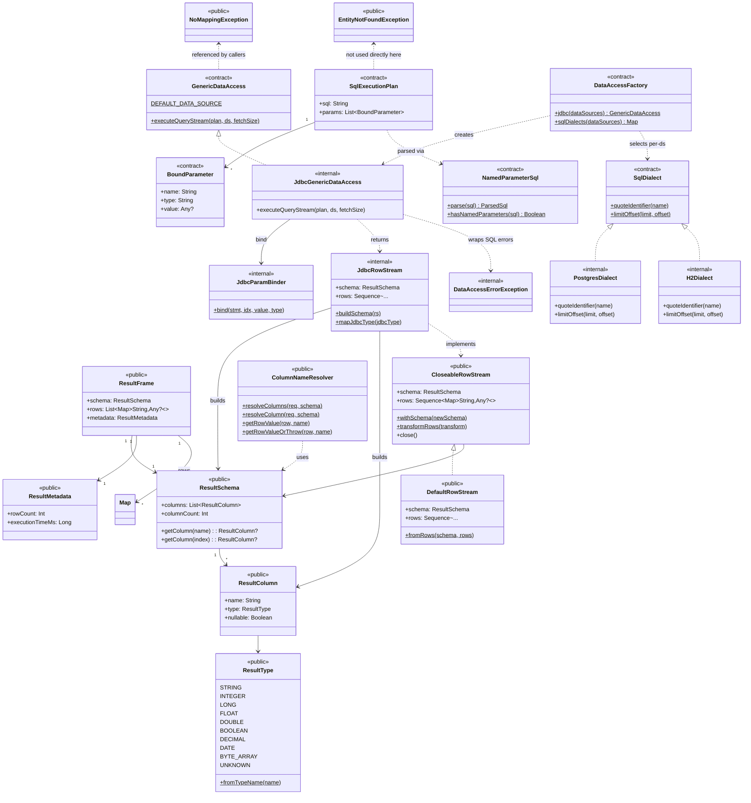

# Core Class Diagram — `helianthus-core`

## Purpose

Show the architecturally meaningful types in `helianthus-core`: the result model, the data-access contracts, the JDBC implementation of those contracts, and the exceptions that cross module boundaries. Internal types are shaded to make clear what is and is not supported API.

## Source evidence

- Visibility classification taken from current Kotlin declarations (see `HEL-KOTLIN-006` for the boundary enforcement).
- `DataAccessFactory` is the only public type that constructs a JDBC-backed `GenericDataAccess`; it is a cross-module seam.
- `JdbcGenericDataAccess`, `JdbcRowStream`, `JdbcParamBinder`, `PostgresDialect`, `H2Dialect`, and `DataAccessErrorException` are `internal` and cannot be referenced from outside `helianthus-core`.

## Diagram

## What the diagram is communicating

- **Result model** — `ResultFrame` is the canonical payload. It owns a `ResultSchema` (column list), `ResultMetadata` (row count / execution time), and rows as `Map<String, Any?>`.
- **Streaming abstraction** — `CloseableRowStream` is the lazy interface; `DefaultRowStream` is the default in-memory implementation. `JdbcRowStream` is the JDBC-backed `internal` implementation.
- **Data-access seam** — `GenericDataAccess` and `SqlDialect` are interfaces intentionally narrow enough to support multiple implementations. `DataAccessFactory` is the single public way to construct a `GenericDataAccess` and a `SqlDialect` map from named `DataSource`s; it hides the JDBC classes.
- **Parameter binding contract** — `NamedParameterSql` rewrites `:name` placeholders to `?`; `SqlExecutionPlan` carries the rewritten SQL plus its `BoundParameter`s.
- **Boundary** — the JDBC classes (`JdbcGenericDataAccess`, `JdbcRowStream`, `JdbcParamBinder`, `PostgresDialect`, `H2Dialect`) and `DataAccessErrorException` are `internal`; they cannot appear in any non-`core` module's source.

## Principal files

- Result model: `result/ResultFrame.kt`, `ResultSchema.kt`, `ResultColumn.kt`, `ResultMetadata.kt`, `ResultType.kt`, `CloseableRowStream.kt`, `DefaultRowStream.kt`, `ColumnNameResolver.kt`
- Data-access contracts: `access/GenericDataAccess.kt`, `SqlDialect.kt`, `SqlExecutionPlan.kt`, `DataAccessFactory.kt`
- SQL parsing: `access/sql/NamedParameterSql.kt`
- JDBC implementation: `access/impl/db/JdbcGenericDataAccess.kt`, `JdbcRowStream.kt`, `JdbcParamBinder.kt`, `PostgresDialect.kt`, `H2Dialect.kt`
- Exceptions: `NoMappingException.kt`, `EntityNotFoundException.kt`, `DataAccessErrorException.kt`

## Related diagrams

- [Runtime class diagram](./classes-runtime.md) shows who uses the result model and the data-access contracts.
- [Web class diagram](./classes-web.md) shows that the web module depends on the public types in this diagram only.
