# Runtime Class Diagram — `helianthus-runtime`

## Purpose

Show the framework-neutral runtime facade and its major internal collaborators. The runtime module is the largest in the system, so the diagram groups catalog definitions (`*Def`), pipeline steps, and filter operators to keep the picture legible.

## Source evidence

- `HelianthusRuntime` constructor is `internal`; consumers must use `HelianthusRuntimeBuilder.build(inputStream)`.
- `HelianthusRuntimeBuilder.build(...)` constructs, in order: `CatalogLoader().load(inputStream)`, `DataAccessFactory.jdbc(...)`, `DataAccessFactory.sqlDialects(...)`, `OperationPermissionEvaluator`, `EntityPermissionEvaluator`, `PipelineFactory`, `EntityService`, then `HelianthusRuntime(...)`.
- `PipelineFactory.createPipeline(...)` returns a `Pipeline` with seven `PipelineComponent`s in this exact order: `ResolveStep`, `BindStep`, `QueryStep`, `ProjectStep`, `FilterStep`, `LimitStep`, `ToResultFrameStep`.
- The catalog loader produces a `LoadedCatalog(operationCatalog, entityCatalog)` and performs both JSON-Schema validation and structural validation.
- Permission evaluators consult their respective catalogs (`OperationCatalog` / `EntityCatalog`) and a `Principal`; `ADMIN_ROLE` bypasses all checks.

## Diagram

```mermaid
classDiagram
    class HelianthusRuntime {
        <<public>>
        +executeOperation(principal, opId, cfg, params)$
        +listEntities(principal, req)$
        +getEntity(principal, name, id)$
        +catalogSummary(principal)$
    }

    class HelianthusRuntimeBuilder {
        <<public>>
        -dataSources: Map~String, DataSource~
        +build(catalogInput)$ HelianthusRuntime
    }

    class Principal {
        <<public>>
        +name: String
        +roles: Set~String~
    }

    class AccessDeniedException {
        <<public>>
    }

    class EntityListRequest {
        <<public>>
        +entityName: String
        +filters: Map~String,String~
        +orderBy: String?
        +orderDir: String?
        +limit: String?
        +offset: String?
    }

    class CatalogSummary {
        <<public>>
        +app: String?
        +formats: List~String~
        +operations: List~OperationSummary~
        +entities: List~EntitySummary~
    }

    class CatalogLoader {
        <<internal>>
        +load(inputStream)$ LoadedCatalog
    }

    class OperationCatalog {
        <<internal>>
        +operations: Map~String, OperationDef~
        +resolveOperation(opId, cfgId)$ ResolvedCatalogEntry
    }

    class EntityCatalog {
        <<internal>>
        +entities: Map~String, EntityDef~
        +resolveEntity(name)$
        +validate(datasources)$
    }

    class EntityCrudSqlBuilder {
        <<internal>>
        +buildListSql(entity, filters, orderBy, orderDir, limit, offset)$
        +buildGetByIdSql(entity, id)$
    }

    class PipelineFactory {
        <<internal>>
        +createPipeline(request)$ Pipeline
    }

    class Pipeline {
        <<internal>>
        +execute(context)$ PipelineContext
    }

    class PipelineComponent {
        <<internal>>
        <<interface>>
        +process(context)$ PipelineContext
    }

    class ResolveStep {
        <<internal>>
    }
    class BindStep {
        <<internal>>
    }
    class QueryStep {
        <<internal>>
    }
    class ProjectStep {
        <<internal>>
    }
    class FilterStep {
        <<internal>>
    }
    class LimitStep {
        <<internal>>
    }
    class ToResultFrameStep {
        <<internal>>
    }

    class FilterOperatorRegistry {
        <<internal>>
        +evaluateCondition(value, condition)$
    }
    class FilterOperator {
        <<internal>>
        <<interface>>
        +key: String
        +evaluate(value, args)$
    }
    class FilterOperators {
        <<internal>>
        +key: String
        +evaluate(value, args)$
    }

    class OperationPermissionEvaluator {
        <<internal>>
        +checkPermission(principal, opId, cfgId)$
        +filterVisibleOperations(principal)$
    }
    class EntityPermissionEvaluator {
        <<internal>>
        +checkReadPermission(principal, entityName)$
        +filterVisibleEntities(principal)$
    }

    class EntityService {
        <<internal>>
        +listEntities(principal, request)$
        +getEntity(principal, name, id)$
    }

    class OperationRequest {
        <<internal>>
        +operationId: String
        +configurationId: String
        +format: String
        +params: Map~String,String~
    }

    class PipelineContext {
        <<internal>>
        +resolvedOperation: ResolvedOperation?
        +boundParameters: BoundParameters?
        +rowStream: CloseableRowStream?
        +resultFrame: ResultFrame?
        +error: Exception?
    }

    class CatalogDefinitions {
        <<internal>>
        "OperationDef, ParameterDef, ConfigurationDef,
        EntityDef, FieldDef, PrimaryKeyDef,
        EntitySecurityDef, EntityRoleDef, SecurityDef,
        QueryDef, DatasourceDef, AppMetadata,
        ResolvedCatalogEntry"
    }

    HelianthusRuntimeBuilder ..> CatalogLoader : loads
    HelianthusRuntimeBuilder ..> OperationCatalog : builds
    HelianthusRuntimeBuilder ..> EntityCatalog : builds
    HelianthusRuntimeBuilder ..> PipelineFactory : builds
    HelianthusRuntimeBuilder ..> EntityService : builds
    HelianthusRuntimeBuilder ..> OperationPermissionEvaluator : builds
    HelianthusRuntimeBuilder ..> EntityPermissionEvaluator : builds
    HelianthusRuntimeBuilder ..> DataAccessFactory : calls (cross-module)
    HelianthusRuntimeBuilder ..> GenericDataAccess : wires
    HelianthusRuntimeBuilder ..> HelianthusRuntime : returns

    HelianthusRuntime --> OperationCatalog
    HelianthusRuntime --> PipelineFactory
    HelianthusRuntime --> OperationPermissionEvaluator
    HelianthusRuntime --> EntityPermissionEvaluator
    HelianthusRuntime --> EntityService
    HelianthusRuntime --> EntityCatalog
    HelianthusRuntime --> Principal : takes
    HelianthusRuntime --> EntityListRequest : takes
    HelianthusRuntime --> CatalogSummary : produces
    HelianthusRuntime ..> AccessDeniedException : throws
    HelianthusRuntime ..> NoMappingException : throws

    PipelineFactory --> OperationCatalog
    PipelineFactory --> GenericDataAccess
    PipelineFactory ..> Pipeline : creates
    PipelineFactory ..> ResolveStep : builds chain
    PipelineFactory ..> BindStep
    PipelineFactory ..> QueryStep
    PipelineFactory ..> ProjectStep
    PipelineFactory ..> FilterStep
    PipelineFactory ..> LimitStep
    PipelineFactory ..> ToResultFrameStep

    Pipeline --> PipelineComponent : ordered list
    PipelineComponent <|.. ResolveStep
    PipelineComponent <|.. BindStep
    PipelineComponent <|.. QueryStep
    PipelineComponent <|.. ProjectStep
    PipelineComponent <|.. FilterStep
    PipelineComponent <|.. LimitStep
    PipelineComponent <|.. ToResultFrameStep
    QueryStep --> GenericDataAccess
    PipelineContext ..> Pipeline : carries

    FilterStep --> FilterOperatorRegistry
    FilterOperatorRegistry --> FilterOperator : registry
    FilterOperator <|.. FilterOperators

    OperationPermissionEvaluator --> OperationCatalog
    OperationPermissionEvaluator --> Principal
    EntityPermissionEvaluator --> EntityCatalog
    EntityPermissionEvaluator --> Principal

    EntityService --> EntityCatalog
    EntityService --> EntityPermissionEvaluator
    EntityService --> EntityCrudSqlBuilder
    EntityService --> GenericDataAccess
    EntityService --> SqlDialect
    EntityService --> Principal
    EntityService --> EntityListRequest
    EntityService ..> EntityNotFoundException : throws
    EntityService ..> AccessDeniedException : throws
    EntityService ..> InvalidParameterException : throws

    EntityCrudSqlBuilder --> SqlDialect

    OperationCatalog ..> CatalogDefinitions : contains
    EntityCatalog ..> CatalogDefinitions : contains
    CatalogLoader --> OperationCatalog : produces
    CatalogLoader --> EntityCatalog : produces
```

## What the diagram is communicating

- **`HelianthusRuntime` is the only public runtime API** that adapters should call (`executeOperation`, `listEntities`, `getEntity`, `catalogSummary`). Its constructor is `internal` so the only construction path is `HelianthusRuntimeBuilder`.
- **`HelianthusRuntimeBuilder.build(...)` is the wiring hub.** It produces every collaborator in a fixed order so the runtime is fully self-contained at startup.
- **The pipeline is a fixed ordered chain** of seven steps ending with materialization to `ResultFrame`. Each step implements `PipelineComponent.process(context)`.
- **Authorization is centralized.** `OperationPermissionEvaluator` and `EntityPermissionEvaluator` both consult their respective catalogs and a `Principal`; `ADMIN_ROLE` is the bypass. The seven filter operator classes (`EqOperator`, `NeqOperator`, `GtOperator`, `GteOperator`, `LtOperator`, `LteOperator`, `InOperator`) are grouped into `FilterOperators` because they share a single interface and a single registry.
- **Entity execution is structurally identical to pipeline execution at a coarse level** — authorize, resolve, build SQL via the dialect-aware `EntityCrudSqlBuilder`, run via `GenericDataAccess`, materialize — but it is a direct path rather than a step chain.

## Principal files

- Runtime facade: `HelianthusRuntime.kt`, `HelianthusRuntimeBuilder.kt`
- Catalog: `catalog/CatalogLoader.kt`, `OperationCatalog.kt`, `EntityCatalog.kt`, `EntityCrudSqlBuilder.kt`, `CatalogSummary.kt`, `PhysicalColumnNamingStrategy.kt`
- Pipeline: `pipeline/PipelineFactory.kt`, `Pipeline.kt`, `PipelineComponent.kt`, `PipelineModels.kt`, `ResolveStep.kt`, `BindStep.kt`, `QueryStep.kt`, `ProjectStep.kt`, `FilterStep.kt`, `LimitStep.kt`, `ToResultFrameStep.kt`, `RowStream.kt`, `FilterOperatorRegistry.kt`, `FilterOperator.kt`, `EqOperator.kt`, `NeqOperator.kt`, `GtOperator.kt`, `GteOperator.kt`, `LtOperator.kt`, `LteOperator.kt`, `InOperator.kt`
- Security: `security/Principal.kt`, `AccessDeniedException.kt`, `OperationPermissionEvaluator.kt`, `EntityPermissionEvaluator.kt`
- Service: `service/EntityService.kt`
- Path handlers: `util/PathHandler.kt`, `util/EntityPathHandler.kt`
- Exceptions: `InvalidParameterException.kt`, `exception/InvalidOperationPathException.kt`

## Related diagrams

- [Core class diagram](./classes-core.md) — shows the contracts (`GenericDataAccess`, `SqlDialect`, `ResultFrame`, `SqlExecutionPlan`) consumed here.
- [Web class diagram](./classes-web.md) — shows the controllers that consume the public runtime surface.
- [Sequence diagram](./sequence-operation.md) — shows one execution in detail.
