# Web Class Diagram — `helianthus-web`

## Purpose

Show the Spring adapter layer. Make the boundary obvious: controllers depend only on the `HelianthusRuntime` facade and a small set of public types from `helianthus-runtime` and `helianthus-core`. They do **not** reach into the pipeline, the entity service, the permission evaluators, or any JDBC implementation.

## Source evidence

- Every web source file was inspected for imports from `helianthus.core.*`. Only public types are imported: `HelianthusRuntime`, `HelianthusRuntimeBuilder`, `CatalogSummary`, `EntityListRequest`, `PathHandler`, `EntityPathHandler`, `AccessDeniedException`, `EntityNotFoundException`, `InvalidParameterException`, `NoMappingException`, `ResultFrame`, `ColumnNameResolver`. No `internal` type is referenced from web code.
- `CatalogConfig.helianthusRuntime(...)` is the single `@Bean` that constructs `HelianthusRuntime` via `HelianthusRuntimeBuilder(dataSources).build(catalogResource.inputStream)`.
- The Spring Security filter chain (`SecurityConfig`) is set up before the controllers run; it produces an `Authentication` that the controllers convert to `Principal` via the local `toPrincipal()` extension.
- `HelianthusWebConfiguration.extendMessageConverters(...)` registers the three `ResultFrame` message converters ahead of Jackson so content-type negotiation selects them for HTML, CSV, and XML.

## Diagram

```mermaid
classDiagram
    class HelianthusApplication {
        <<public>>
        +main(args)$
    }

    class CatalogConfig {
        <<public>>
        +helianthusRuntime(dataSources)$ HelianthusRuntime
        +pathHandler()$ PathHandler
        +entityPathHandler()$ EntityPathHandler
    }

    class DataSourceConfig {
        <<public>>
        +primaryDataSource(url, user, pw, driver)$ DataSource
        +secondaryDataSource(url, user, pw, driver)$ DataSource
        +dataSources(primary, secondary)$ Map~String, DataSource~
    }

    class SecurityConfig {
        <<public>>
        +securityFilterChain(http)$ SecurityFilterChain
        +corsConfigurationSource()$ CorsConfigurationSource
    }

    class HelianthusWebConfiguration {
        <<public>>
        +extendMessageConverters(converters)
    }

    class HelianthusController {
        <<public>>
        +handle(request)$ ResponseEntity~ResultFrame~
    }

    class EntityCrudController {
        <<public>>
        +handle(request)$ ResponseEntity~ResultFrame~
    }

    class CatalogController {
        <<public>>
        +catalog()$ CatalogSummary
    }

    class HealthController {
        <<public>>
        +health()$ Map~String,String~
    }

    class HelianthusExceptionHandler {
        <<public>>
        +handleInvalidOperationPath(ex)
        +handleNoMapping(ex)
        +handleEntityNotFound(ex)
        +handleInvalidParameter(ex)
        +handleAccessDenied(ex)
        +handleHelianthusAccessDenied(ex)
        +handleUnexpected(ex)
    }

    class RequestLoggingFilter {
        <<public>>
        +doFilterInternal(req, res, chain)
    }

    class ResultFrameHtmlMessageConverter {
        <<public>>
        +supports(clazz)
        +writeInternal(frame, output)
    }

    class ResultFrameCsvMessageConverter {
        <<public>>
        +supports(clazz)
        +writeInternal(frame, output)
    }

    class ResultFrameXmlMessageConverter {
        <<public>>
        +supports(clazz)
        +writeInternal(frame, output)
    }

    class ResultFrameHtmlRenderer {
        <<public>>
        +render(frame)$ String
    }

    class toPrincipal {
        <<extension>>
        Authentication --> Principal
    }

    class HelianthusRuntime {
        <<public>>
    }

    class PathHandler {
        <<public>>
    }

    class EntityPathHandler {
        <<public>>
    }

    class ResultFrame {
        <<public>>
    }

    class CatalogSummary {
        <<public>>
    }

    class EntityListRequest {
        <<public>>
    }

    class ColumnNameResolver {
        <<public>>
    }

    CatalogConfig --> HelianthusRuntime : @Bean
    CatalogConfig --> PathHandler : @Bean
    CatalogConfig --> EntityPathHandler : @Bean
    CatalogConfig --> DataSourceConfig : consumes DataSource map
    CatalogConfig --> HelianthusRuntimeBuilder : uses

    HelianthusController --> PathHandler
    HelianthusController --> HelianthusRuntime
    HelianthusController --> toPrincipal : uses adapter
    HelianthusController --> ResultFrame : produces

    EntityCrudController --> EntityPathHandler
    EntityCrudController --> HelianthusRuntime
    EntityCrudController --> EntityListRequest
    EntityCrudController --> toPrincipal
    EntityCrudController --> ResultFrame

    CatalogController --> HelianthusRuntime
    CatalogController --> CatalogSummary
    CatalogController --> toPrincipal

    HelianthusWebConfiguration --> ResultFrameHtmlMessageConverter : registers
    HelianthusWebConfiguration --> ResultFrameCsvMessageConverter : registers
    HelianthusWebConfiguration --> ResultFrameXmlMessageConverter : registers

    ResultFrameHtmlMessageConverter --> ResultFrameHtmlRenderer : delegates
    ResultFrameHtmlMessageConverter --> ResultFrame
    ResultFrameCsvMessageConverter --> ResultFrame
    ResultFrameCsvMessageConverter --> ColumnNameResolver : looks up values
    ResultFrameXmlMessageConverter --> ResultFrame
    ResultFrameXmlMessageConverter --> ColumnNameResolver

    HelianthusExceptionHandler --> EntityNotFoundException : maps to 404
    HelianthusExceptionHandler --> NoMappingException : maps to 404
    HelianthusExceptionHandler --> InvalidParameterException : maps to 400
    HelianthusExceptionHandler --> AccessDeniedException : maps to 403
    HelianthusExceptionHandler --> InvalidOperationPathException : maps to 400

    RequestLoggingFilter ..> HelianthusController : logs MDC around

    toPrincipal ..> Principal : produces
    toPrincipal ..> Authentication : consumes
```

## What the diagram is communicating

- **The web module is an adapter.** Controllers never touch `Pipeline`, `EntityService`, `OperationCatalog`, `EntityCatalog`, `GenericDataAccess`, `JdbcGenericDataAccess`, `OperationPermissionEvaluator`, or `EntityPermissionEvaluator`. The single point of contact with the runtime is the `HelianthusRuntime` facade and the small public result type `ResultFrame` (and `CatalogSummary`, `EntityListRequest` for the entity/catalog variants).
- **`CatalogConfig` is the wiring point.** It is the only place that calls `HelianthusRuntimeBuilder.build(...)`. No controller does so.
- **Spring Security produces an `Authentication`; the local `toPrincipal` extension converts it to the framework-neutral `Principal`.** Permission rules in the runtime never see Spring types.
- **Content negotiation is owned by the web module.** Three message converters are registered ahead of Jackson; the runtime is format-agnostic.
- **`HelianthusExceptionHandler` translates runtime exceptions into HTTP responses** (`NoMappingException`/`EntityNotFoundException` → 404, `InvalidParameterException` → 400, `AccessDeniedException` → 403).

## Principal files

- Entry point: `HelianthusApplication.kt`
- Configuration: `config/CatalogConfig.kt`, `DataSourceConfig.kt`, `SecurityConfig.kt`, `HelianthusWebConfiguration.kt`
- Controllers: `web/HelianthusController.kt`, `EntityCrudController.kt`, `CatalogController.kt`, `HealthController.kt`
- Adapter: `security/SpringAuthenticationAdapter.kt`
- Cross-cutting: `web/HelianthusExceptionHandler.kt`, `web/RequestLoggingFilter.kt`
- Converters: `web/converter/ResultFrameHtmlMessageConverter.kt`, `ResultFrameCsvMessageConverter.kt`, `ResultFrameXmlMessageConverter.kt`, `ResultFrameHtmlRenderer.kt`

## Related diagrams

- [Runtime class diagram](./classes-runtime.md) — shows the public surface that the web layer consumes.
- [Sequence diagram](./sequence-operation.md) — shows one web-to-runtime flow in detail.
