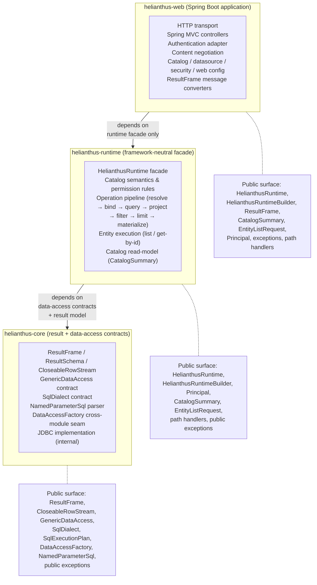

# Module Diagram

## Purpose

Show the three Maven modules of the Helianthus server, their dependency direction, and the responsibility of each. This is an architectural orientation diagram — it does not enumerate every class.

## Source evidence

- `server/pom.xml` declares the three modules: `helianthus`, `helianthus-runtime`, `helianthus-web`.
- `server/helianthus/pom.xml` depends on no other Helianthus module.
- `server/helianthus-runtime/pom.xml` depends only on `helianthus:helianthus-core`.
- `server/helianthus-web/pom.xml` depends only on `helianthus:helianthus-runtime`.
- The dependency graph is therefore strictly `web → runtime → core` (acyclic, no inverse edges).

## Diagram

## What the diagram is communicating

- **Acyclic dependency direction.** `web → runtime → core`. `core` has no dependency on either sibling; `runtime` does not depend on `web`.
- **Boundaries, not implementations.** Each module box names its responsibility rather than listing every class.
- **Public surfaces are listed for orientation** — they are the only types a downstream consumer should target.

## Principal classes involved

| Module | Entry types |
| --- | --- |
| `helianthus-web` | `HelianthusApplication`, `HelianthusController`, `EntityCrudController`, `CatalogController`, `CatalogConfig`, `DataSourceConfig`, `SecurityConfig`, `HelianthusExceptionHandler`, `RequestLoggingFilter`, `HelianthusWebConfiguration` |
| `helianthus-runtime` | `HelianthusRuntime`, `HelianthusRuntimeBuilder`, `CatalogLoader`, `OperationCatalog`, `EntityCatalog`, `PipelineFactory`, `EntityService` |
| `helianthus-core` | `ResultFrame`, `CloseableRowStream`, `GenericDataAccess`, `SqlDialect`, `NamedParameterSql`, `DataAccessFactory` |

## Related diagrams

- [Core class diagram](./classes-core.md)
- [Runtime class diagram](./classes-runtime.md)
- [Web class diagram](./classes-web.md)
