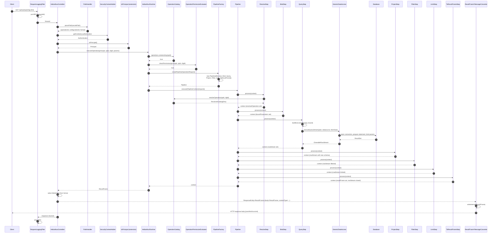
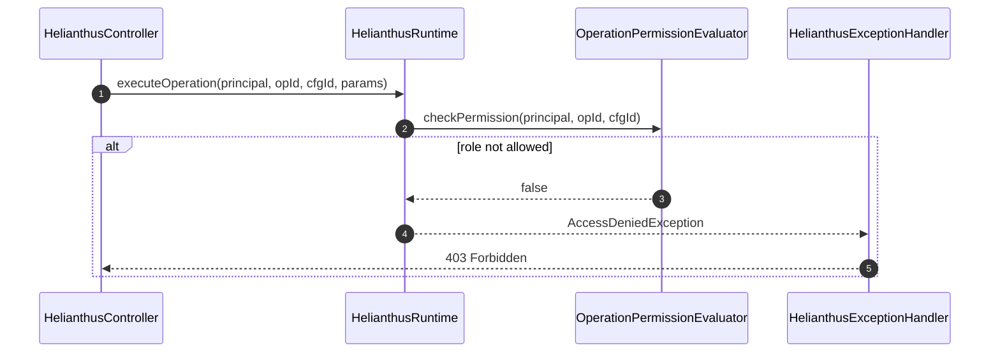

# Operation Execution Sequence

## Purpose

Method-level collaboration for one successful operation execution, from the inbound HTTP request through the full pipeline to the response. Branches are minimal — only the critical authorization failure is shown — because the goal is to make the steady-state path legible.

## Source evidence

- `HelianthusController.handle(HttpServletRequest)` is the entry point on `/api/op/**`. It calls `PathHandler.parsePath`, reads the `Authentication`, converts via `toPrincipal`, and calls `HelianthusRuntime.executeOperation(...)`.
- `HelianthusRuntime.executeOperation(...)` performs the existence check on `operationCatalog.operations`, calls `operationPermissionEvaluator.checkPermission(...)`, builds an `OperationRequest` (with `format = "json"`), calls `pipelineFactory.createPipeline(request)`, creates a `PipelineContext`, and runs `pipeline.execute(context)`.
- `Pipeline.execute(...)` iterates the components in order, short-circuiting if `context.error` is set.
- `ResolveStep.process(...)` calls `catalog.resolveOperation(...)`, producing a `ResolvedOperation`. `BindStep.process(...)` coerces and validates parameters, producing `BoundParameters` (or `InvalidParameterException`). `QueryStep.process(...)` builds an `SqlExecutionPlan` (named or positional) and calls `dataAccess.executeQueryStream(...)`. The remaining four steps operate on the returned `CloseableRowStream` until `ToResultFrameStep` materializes a `ResultFrame`.
- On return, the controller selects a `MediaType` from the format extension and lets Spring's `HttpMessageConverter` chain (HTML/CSV/XML converters registered ahead of Jackson) serialize the `ResultFrame`.

## Diagram

### Branches (informational)

## What the diagram is communicating

- **The success path is a fixed sequence.** Spring Security pre-authenticates; the controller adapts; the runtime validates, builds a pipeline, runs seven ordered steps, and returns a `ResultFrame`. There are no conditional branches in the happy path.
- **The runtime, not the controller, owns authorization.** The controller never sees `OperationPermissionEvaluator`; it only sees `Principal` and the exception type via `HelianthusExceptionHandler`.
- **The data-access contract (`GenericDataAccess`) is the only seam between the runtime and any database.** The pipeline does not know about JDBC.
- **The web layer selects the converter, but the runtime is format-agnostic.** Content negotiation happens after `HelianthusRuntime.executeOperation` returns.
- **MDC lifecycle is request-scoped.** `RequestLoggingFilter` puts `requestId` into MDC before the controller and clears it on the way out, so all logging within the request is correlated.

## Principal classes involved

| Layer | Class / file |
| --- | --- |
| HTTP transport | `web/RequestLoggingFilter.kt`, `config/SecurityConfig.kt`, `web/HelianthusController.kt` |
| Path / principal | `util/PathHandler.kt`, `security/SpringAuthenticationAdapter.kt` |
| Runtime | `HelianthusRuntime.kt`, `security/OperationPermissionEvaluator.kt`, `pipeline/PipelineFactory.kt`, `pipeline/Pipeline.kt` |
| Pipeline steps | `pipeline/ResolveStep.kt`, `BindStep.kt`, `QueryStep.kt`, `ProjectStep.kt`, `FilterStep.kt`, `LimitStep.kt`, `ToResultFrameStep.kt` |
| Data access | `access/GenericDataAccess.kt`, `access/impl/db/JdbcGenericDataAccess.kt` (`internal`) |
| Result | `result/ResultFrame.kt`, `result/CloseableRowStream.kt` |
| Conversion | `config/HelianthusWebConfiguration.kt`, `web/converter/ResultFrameHtmlMessageConverter.kt`, `ResultFrameCsvMessageConverter.kt`, `ResultFrameXmlMessageConverter.kt` |
| Errors | `web/HelianthusExceptionHandler.kt` |

## Related diagrams

- [Operation workflow](./workflow-operation.md) for the stage-level view.
- [Runtime class diagram](./classes-runtime.md) for the static structure.
