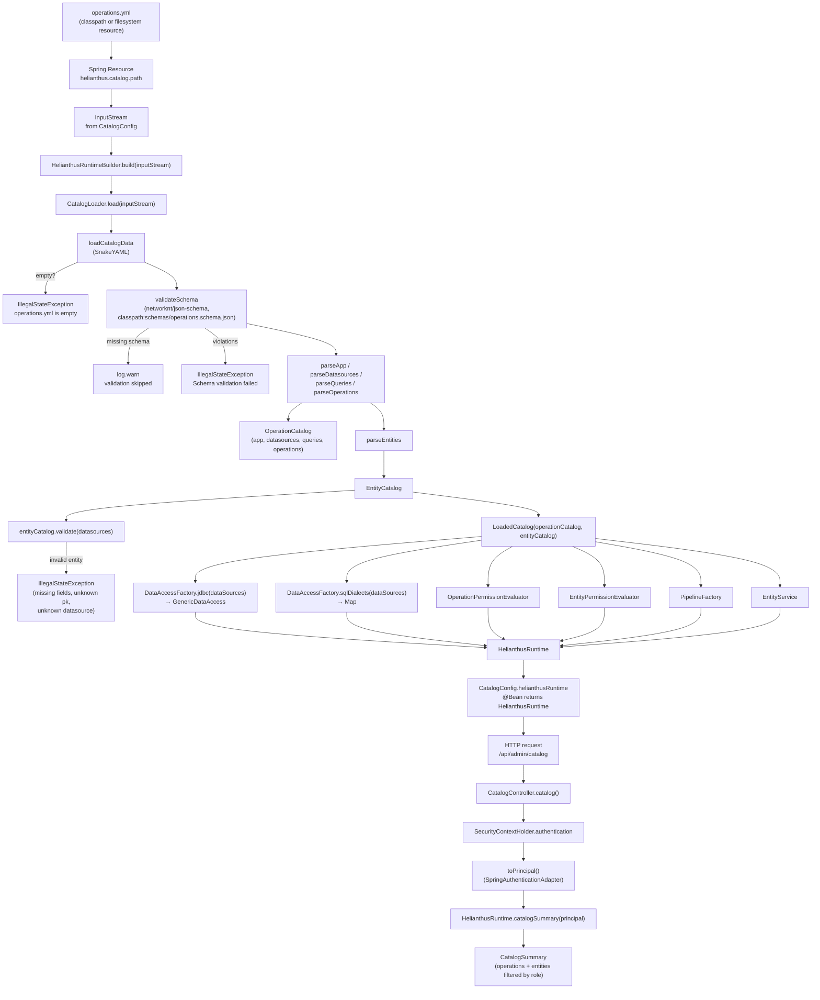

# Catalog Workflow

## Purpose

Trace how `operations.yml` becomes the in-memory `OperationCatalog` + `EntityCatalog` and the supporting collaborators that `HelianthusRuntime` holds. The diagram covers startup, including the major failure points.

## Source evidence

- `CatalogConfig.helianthusRuntime(dataSources)` resolves a `Resource` from `helianthus.catalog.path`, opens an `InputStream`, and calls `HelianthusRuntimeBuilder(dataSources).build(inputStream)`.
- `HelianthusRuntimeBuilder.build(...)` calls `CatalogLoader().load(inputStream)`, then constructs the rest of the runtime around the resulting `LoadedCatalog`.
- `CatalogLoader.load(...)` executes, in order: `loadCatalogData` (SnakeYAML), `validateSchema` (JSON-Schema via networknt), `parseApp/Datasources/Queries/Operations` → `OperationCatalog`, `parseEntities` → `EntityCatalog`, then `entityCatalog.validate(datasources)`.
- The schema resource path is `classpath:schemas/operations.schema.json`; missing schema is logged as a warning and validation is skipped.
- All load failures surface as `IllegalStateException` (`operations.yml is empty`, `Schema validation failed: ...`, structural validation failures from `EntityCatalog.validate`).
- After the runtime is built, `CatalogController.catalog()` calls `HelianthusRuntime.catalogSummary(principal)` for each request.

## Diagram

## What the diagram is communicating

- **Single read of the document.** `CatalogLoader.load(...)` parses YAML, validates against the JSON schema, builds both catalogs, then validates the entity catalog against the available datasources — all from one input stream.
- **Three explicit failure modes** at load time: empty YAML, schema violations, and structural entity validation. Each surfaces as `IllegalStateException` and aborts startup.
- **Schema validation is best-effort.** If `schemas/operations.schema.json` is not on the classpath, a warning is logged and validation is skipped — the rest of the load still proceeds.
- **Runtime collaborators are constructed deterministically** around the loaded catalogs: data access, dialect map, both permission evaluators, the pipeline factory, and the entity service.
- **The catalog is queried lazily.** Catalog data only flows to HTTP when `CatalogController.catalog()` invokes `HelianthusRuntime.catalogSummary(principal)`, which calls both `OperationPermissionEvaluator.filterVisibleOperations` and `EntityPermissionEvaluator.filterVisibleEntities`.

## Principal classes involved

| Step | Class / file |
| --- | --- |
| Spring resource | `config/CatalogConfig.kt` (`@Value helianthus.catalog.path`) |
| Builder | `HelianthusRuntimeBuilder.kt` |
| YAML + schema + parse | `catalog/CatalogLoader.kt` |
| Operation catalog model | `catalog/OperationCatalog.kt`, `catalog/CatalogLoader.kt` |
| Entity catalog model | `catalog/EntityCatalog.kt` |
| Data access + dialects | `access/DataAccessFactory.kt` (`helianthus-core`) |
| Permission evaluators | `security/OperationPermissionEvaluator.kt`, `security/EntityPermissionEvaluator.kt` |
| Pipeline | `pipeline/PipelineFactory.kt` |
| Entity service | `service/EntityService.kt` |
| Web read endpoint | `web/CatalogController.kt` |
| Principal adapter | `security/SpringAuthenticationAdapter.kt` |

## Related diagrams

- [Module diagram](./modules.md) for the module relationships.
- [Runtime class diagram](./classes-runtime.md) for collaborator wiring.
- [Operation workflow](./workflow-operation.md) for the post-startup execution flow.
