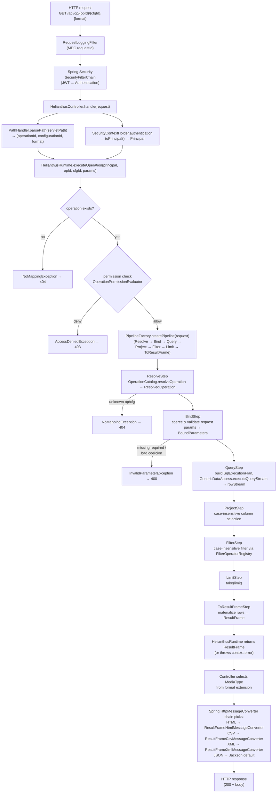

# Operation Workflow

## Purpose

Show the major stages an operation passes through from HTTP request to HTTP response. This is a stage-level diagram; for method-level detail see the [sequence diagram](./sequence-operation.md).

## Source evidence

- `HelianthusController.handle(request)` is the single entry point for `/api/op/**`. It uses `PathHandler`, reads `SecurityContextHolder`, and calls `HelianthusRuntime.executeOperation(...)`.
- The seven pipeline steps are constructed in this fixed order by `PipelineFactory.createPipeline`: `ResolveStep` → `BindStep` → `QueryStep` → `ProjectStep` → `FilterStep` → `LimitStep` → `ToResultFrameStep`.
- `HelianthusRuntime.executeOperation` performs the existence check and the permission check **before** building the pipeline, throwing `NoMappingException` / `AccessDeniedException` as appropriate.
- Step failures are captured on `PipelineContext.error` and re-thrown by the runtime; only `ToResultFrameStep` and `ProjectStep`/`FilterStep`/`LimitStep` do not normally throw — but the runtime's error check is the canonical exit path for any pipeline failure.
- `ResultFrame` is returned to the controller, which selects a `MediaType` from the path's format extension; Spring's content negotiation dispatches to one of the registered `ResultFrame*MessageConverter`s.

## Diagram

## What the diagram is communicating

- **The controller does not perform authorization.** It only adapts the request (path parsing, principal extraction) and delegates to `HelianthusRuntime.executeOperation`. All business authorization happens inside the runtime via `OperationPermissionEvaluator`.
- **Two pre-flight checks** gate pipeline construction: the operation must exist (`NoMappingException`) and the caller must be permitted (`AccessDeniedException`).
- **The pipeline has exactly seven ordered steps.** A failure in any step captures the exception on `PipelineContext.error`, short-circuits subsequent steps, and is re-thrown by the runtime when `pipeline.execute(...)` returns.
- **Step ordering is fixed by `PipelineFactory`** — there is no runtime-configurable reordering. `ResolveStep` and `BindStep` are pre-query; `ProjectStep`, `FilterStep`, and `LimitStep` are post-query, applied to the in-memory row stream; `ToResultFrameStep` materializes the final frame.
- **Format negotiation lives in the web layer.** The runtime always sets `format = "json"` on its internal `OperationRequest`; the controller maps the path extension to a `MediaType` so the right message converter handles the `ResultFrame`.
- **Important branches are shown explicitly:** unknown operation/configuration, authorization failure, missing/invalid parameter, and the four output formats.

## Principal classes involved

| Stage | Class / file |
| --- | --- |
| HTTP filter | `web/RequestLoggingFilter.kt` |
| Security | `config/SecurityConfig.kt` |
| Controller | `web/HelianthusController.kt` |
| Path parsing | `util/PathHandler.kt` |
| Principal adapter | `security/SpringAuthenticationAdapter.kt` |
| Runtime facade | `HelianthusRuntime.kt` |
| Authorization | `security/OperationPermissionEvaluator.kt` |
| Pipeline | `pipeline/PipelineFactory.kt`, `Pipeline.kt`, `PipelineComponent.kt` |
| Pipeline steps | `ResolveStep.kt`, `BindStep.kt`, `QueryStep.kt`, `ProjectStep.kt`, `FilterStep.kt`, `LimitStep.kt`, `ToResultFrameStep.kt` |
| Data access | `access/GenericDataAccess.kt`, `access/DataAccessFactory.kt` |
| Result model | `result/ResultFrame.kt`, `result/CloseableRowStream.kt` |
| Content negotiation | `config/HelianthusWebConfiguration.kt`, `web/converter/ResultFrame*MessageConverter.kt` |
| Exception translation | `web/HelianthusExceptionHandler.kt` |

## Related diagrams

- [Catalog workflow](./workflow-catalog.md) for the startup path.
- [Sequence diagram](./sequence-operation.md) for method-level detail.
